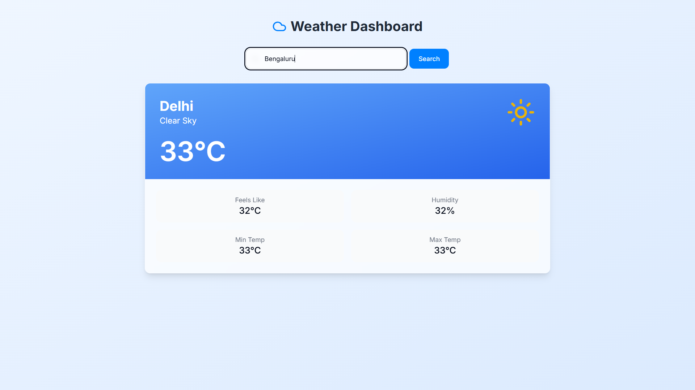
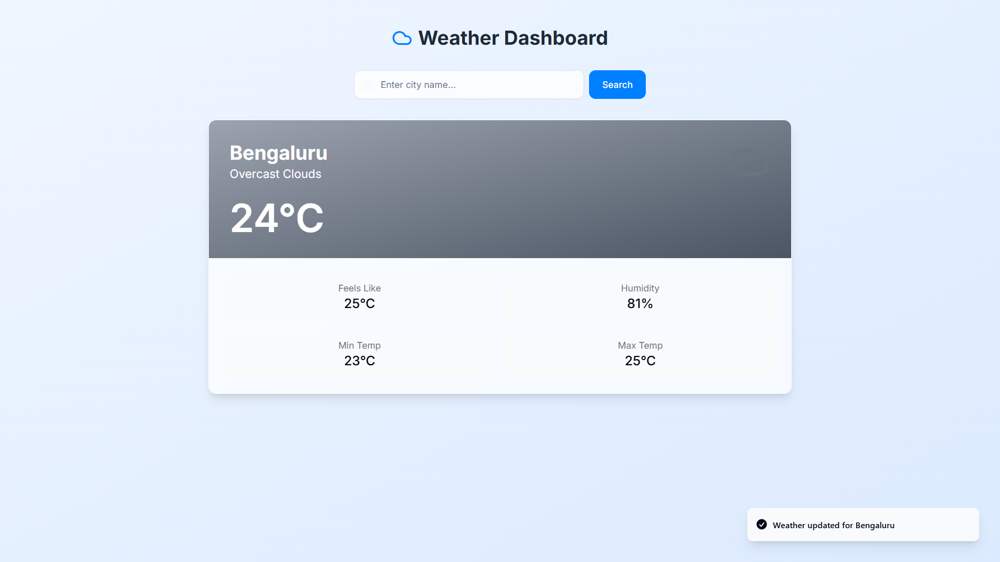

# 🌤️ Weather App

A responsive and minimal weather application built using **React + Vite**, allowing users to search for any city and instantly view real-time weather data including temperature, humidity, and weather conditions

---

## 🚀 Features

- 🔍 Search for any city worldwide
- 🌡️ Displays current temperature, max/min, humidity, and weather status
- 🎯 Fast and clean user interface
- ⚙️ Built with modern React stack (Vite for fast builds)

---

## 📦 Tech Stack

- **Frontend:** React.js (with hooks)
- **Build Tool:** Vite
- **API:** OpenWeatherMap API (or similar weather API)
- **Styling:** Basic inline styles (can be enhanced with Tailwind or CSS modules)

---

## 🧠 Concepts Used

- React `useState` for managing weather data
- Lifting state up to share data between components
- Functional component structure
- Controlled form input handling
- Props drilling

---
## 📸 Screenshots

| Search Weather | Display Weather Info |
|----------------|-----------------------|
|  |  |


## 📁 Folder Structure

📦 weather-app/
├── public/
│ └── index.html
├── src/
│ ├── components/
│ │ ├── SearchBox.jsx
│ │ └── InfoBox.jsx
│ ├── App.jsx
│ ├── main.jsx
├── package.json
└── vite.config.js

---

## 🛠️ Getting Started Locally

```bash
git clone [https://github.com/Abhay-singh-Lodhi/WeatherApp.git]
cd weather-app
npm install
npm run dev
